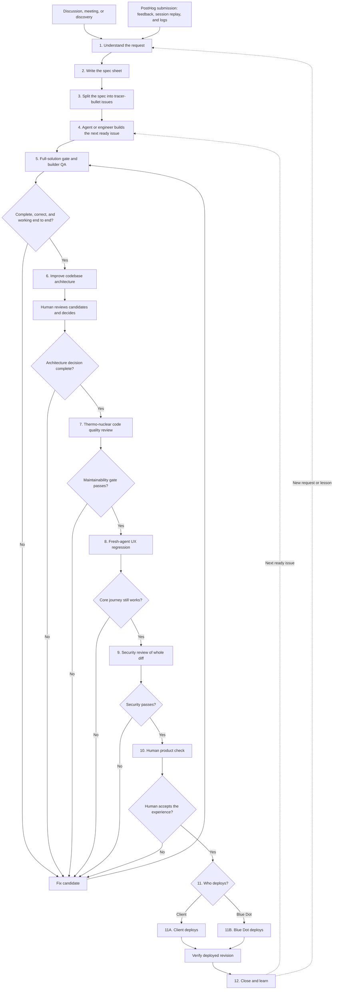

```mermaid
graph TD
    M["Discussion, meeting, or discovery"]
    P["PostHog submission: feedback, session replay, and logs"]
    M --> S1["1. Understand the request"]
    P --> S1
    S1 --> S2["2. Write the spec sheet"]
    S2 --> S3["3. Split the spec into tracer-bullet issues"]
    S3 --> S4["4. Agent or engineer builds the next ready issue"]

    S4 --> S5["5. Full-solution gate and builder QA"]
    S5 --> P5{"Complete, correct, and working end to end?"}
    P5 -->|No| X["Fix candidate"]
    P5 -->|Yes| S6["6. Improve codebase architecture"]

    S6 --> H6["Human reviews candidates and decides"]
    H6 --> P6{"Architecture decision complete?"}
    P6 -->|No| X
    P6 -->|Yes| S7["7. Thermo-nuclear code quality review"]

    S7 --> P7{"Maintainability gate passes?"}
    P7 -->|No| X
    P7 -->|Yes| S8["8. Fresh-agent UX regression"]

    S8 --> P8{"Core journey still works?"}
    P8 -->|No| X
    P8 -->|Yes| S9["9. Security review of whole diff"]

    S9 --> P9{"Security passes?"}
    P9 -->|No| X
    P9 -->|Yes| S10["10. Human product check"]

    S10 --> P10{"Human accepts the experience?"}
    P10 -->|No| X
    P10 -->|Yes| S11{"11. Who deploys?"}
    X --> S5

    S11 -->|Client| S11A["11A. Client deploys"]
    S11 -->|Blue Dot| S11B["11B. Blue Dot deploys"]
    S11A --> V["Verify deployed revision"]
    S11B --> V
    V --> S12["12. Close and learn"]
    S12 -. Next ready issue .-> S4
    S12 -. New request or lesson .-> S1
```
